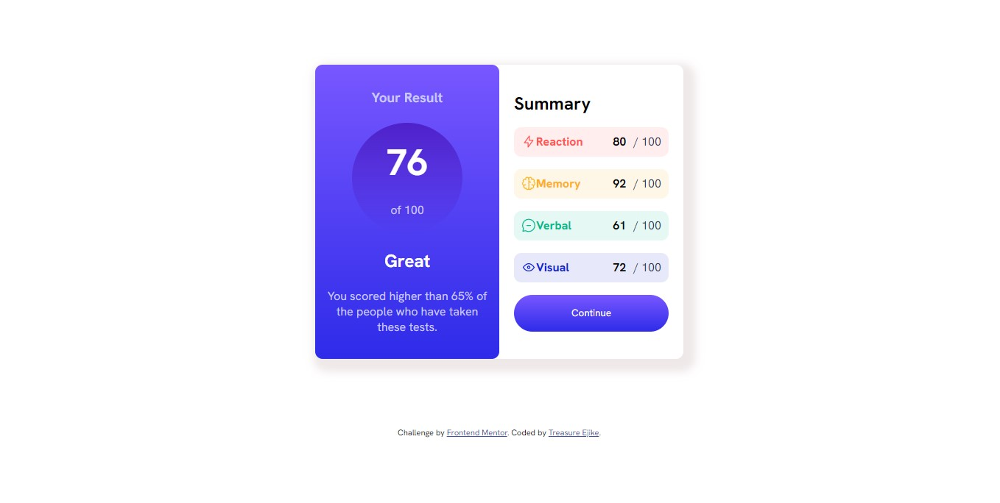

# Frontend Mentor - Results summary component solution

This is a solution to the [Results summary component challenge on Frontend Mentor](https://www.frontendmentor.io/challenges/results-summary-component-CE_K6s0maV). Frontend Mentor challenges help you improve your coding skills by building realistic projects. 

## Table of contents

- [Overview](#overview)
  - [The challenge](#the-challenge)
  - [Screenshot](#screenshot)
  - [Links](#links)
- [My process](#my-process)
  - [Built with](#built-with)
  - [What I learned](#what-i-learned)
  - [Continued development](#continued-development)
  - [Useful resources](#useful-resources)
- [Author](#author)

## Overview

### The challenge

Users should be able to:

- View the optimal layout for the interface depending on their device's screen size
- See hover and focus states for all interactive elements on the page

### Screenshot



### Links

- Solution URL: [Add solution URL here](https://your-solution-url.com)
- Live Site URL: [Add live site URL here](https://your-live-site-url.com)

## My process

### Built with

- Semantic HTML5 markup
- CSS custom properties
- Flexbox
- Visual Studio Code
- Chrome Developer Tools

### What I learned
    In this challenge, I learned how to use media queries when wanting to make a website that has to look different on various devices. A snippet of the code I wrote can be seen below:

```css
@media screen and (min-width: 320px) and (max-width: 480px) {
    .wrapper
    {
        width: 100vw;
        height: 100vh;
        flex-direction: column;
        border-radius: 0;
        box-shadow: none;
    }
}
```

### Continued development
    The knowledge I have in the use of media queries is still scanty so I want to learn more on media queries, and if possible attempt more challenges that use media queries

### Useful resources

- [chatGPT](https://www.chatopenai.com) - This helped me know what media queries were.
- [W3schools](https://www.w3schools.com) - This is an amazing website that helped me understand how to use media queries.

## Author

- Frontend Mentor - [@yourusername](https://www.frontendmentor.io/profile/yourusername)
- Twitter - [@yourusername](https://www.twitter.com/yourusername)